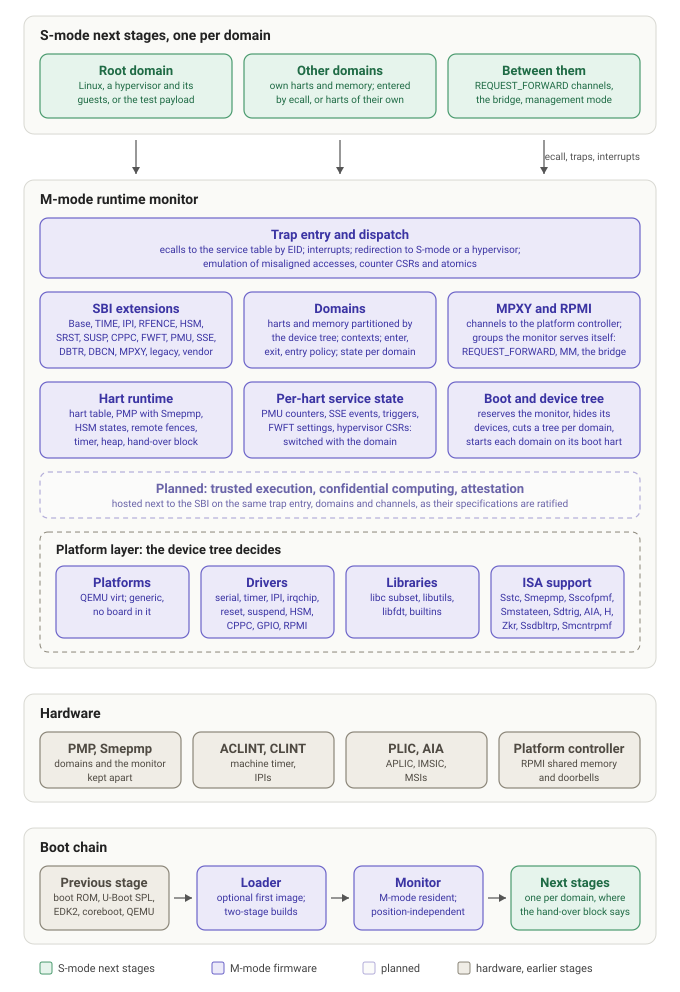

# Architecture

The monitor is the M-mode software of the machine: it takes every trap
that S-mode is not to take, serves the SBI, keeps the harts, the memory
and the devices apart, and hands the rest of the machine to the S-mode
software it starts. This page is the map; the pages after it are the
territory.

## The layers

**S-mode next stages.** What the monitor starts and serves. The machine
is one domain unless the device tree partitions it: each domain has its
harts, its memory regions, its next stage and its rights, and runs one
piece of S-mode software, an operating system, a hypervisor with its
guests, or a trusted environment. A domain without harts of its own is
entered by an ecall from a domain allowed to; domains with harts of their
own talk through MPXY channels that the monitor serves itself, or across
a shared hart through the bridge. [Domains](domains.md) has the whole of
it.

**The monitor.** One trap entry per hart, on the hart's own stack, which
routes ecalls to the service table by extension id, takes the interrupts
the monitor owns, redirects what belongs to S-mode or to a hypervisor
with the guest's fault information, and emulates what the hart does not
do itself: misaligned accesses, counter CSR reads, atomics without the A
extension. The services are the SBI extensions of the ratified
specification, the domain calls, and the MPXY channels, each a table
entry found by the linker. Under them the runtime keeps what every
service needs: the hart table, PMP programmed from the domain's regions
(with Smepmp, the monitor's own memory locked against itself), the HSM
states, remote fences, the timer and the heap. What a service keeps for
S-mode on a hart (PMU counters, SSE events, debug triggers, FWFT
settings, a hypervisor's CSRs) is kept per domain and switched with the
hart. At boot the monitor reserves itself in the device tree, hides the
devices that are its alone, cuts a tree for each domain and starts every
domain on its boot hart. [SBI implementation](sbi.md) says what each
service does and how it is tested.

**The platform layer.** Nothing in the monitor names a board. The device
tree says which devices are there, and the driver table, gathered by the
linker, has a driver probe them: serial consoles, the machine timer, the
IPI device, interrupt controllers, reset and suspend devices, the RPMI
shared-memory transport. The `generic` platform is that and nothing more;
QEMU `virt` adds what the tests need. The ISA extensions the monitor uses
(Sstc, Smepmp, Sscofpmf, Smstateen, Sdtrig, Ssdbltrp, AIA, the H
extension, Zkr, Smcntrpmf) are probed on the boot hart, and everything
works without them, slower or with less. [Build system](build-system.md)
says how a platform, a driver, a service or an image is added.

**Hardware.** PMP keeps the domains and the monitor apart; the ACLINT or
CLINT gives the timer and IPIs; the PLIC or AIA routes external
interrupts, which the monitor sets up and otherwise leaves to S-mode; a
platform microcontroller, where there is one, is reached through RPMI
over shared memory and answers for reset, suspend, hart power, clocks and
the rest.

**The boot chain.** The previous stage, whatever it is, puts the monitor
in memory and jumps to it with the hart id, the device tree and, if it
has one, a hand-over block that says where the next stage is. The
monitor is position-independent and relocates itself; a two-stage build
puts a small loader before it. [Booting the monitor](boot.md) has the
contract.

**Planned.** The monitor is built to host more than the SBI: trusted
execution, confidential computing and attestation services, on the same
trap entry, domains and channels. They come as their specifications are
ratified, and not before.

## What holds it together

* **The threat model** decides what goes where: what S-mode hands the
  monitor is checked against the calling domain's regions, copied before
  it is used, and bounded; the monitor's own memory is out of every
  domain's reach; a hart moves between domains only with leave.
  [Threat model](threat-model.md) says what is protected, from whom, and
  what is not.
* **Tables from the linker.** Services, drivers and platforms register
  themselves in sections the linker gathers; adding one is adding a file.
* **Kconfig** chooses what is built, `W=1` and `-Werror` keep the build
  clean, and the S-mode test payload runs on every build, in every
  configuration the CI has.
